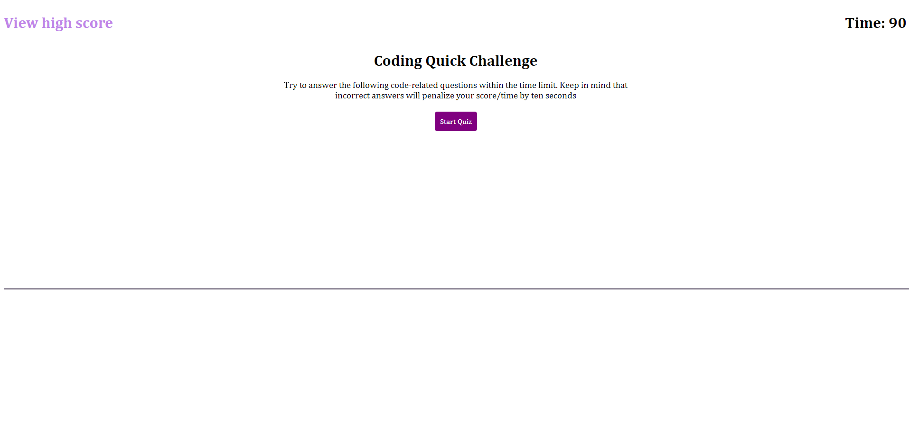
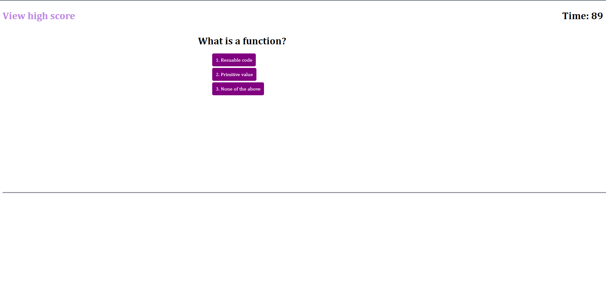
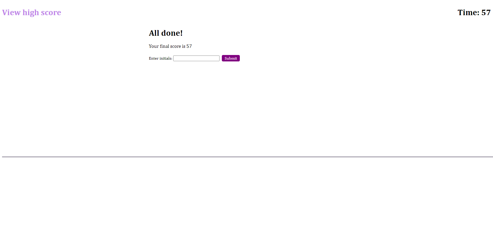
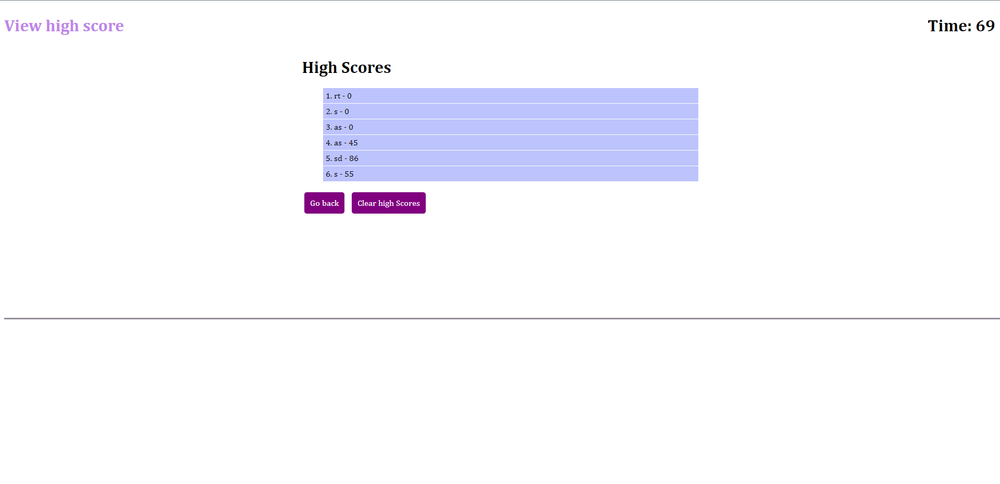

# Challenge 4: Code Quiz

## Description

This project is a webpage that is displaying a code quiz. A user is presented with a button to start the quiz, highscore view button, and a timer. The timer will count down as the start button
is pressed, and the time left on the quiz is the final score that the user will submit to the leaderboard at the end of the quiz. For every question answered wrong, 10 seconds will be deducted from the timer. 
At the end the user will be asked to submit their initials to record their score on the leaderboard. These scores will stay in the user's localStorage and will stay even when the page is refreshed.

This project was the most challenging yet. I think this challenged required the most logic out of all the other challenges and required the most brain power from me. It is probably because I don't
have a lot of experience with data attributes and DOC traversal. Even so, there was a lot I learned, and I feel like if I face these challenges again, I will do much beter.

## Installation

To install the project, clone the repository onto your PC.
Enter the directory that has the cloned repository and open (Double click) the index.html, style.css and script.js files to read the code and access the files.

To access the webpage, click the link below:

https://phipham0.github.io/challenge-4-code-quiz/

## Usage

To start, click the red "Generate Password" button. This will ask the user to insert the number of characters in the password. Be sure to enter a number 
between 7 and 129. Anything else will be an invalid answer, and the user will be asked to enter again. After, there will be four confirms asking if the user wants
to include a character type. Clicking "OK" on the confirm will add the character type, and clicking "Cancel" will not add the character type. If no confirms are added, the user will
go through the list of prompts again. After all the prompts and confirms are added, the password will be generated inside the center text box.

## License

MIT License

Copyright (c) [year] [fullname]

Permission is hereby granted, free of charge, to any person obtaining a copy
of this software and associated documentation files (the "Software"), to deal
in the Software without restriction, including without limitation the rights
to use, copy, modify, merge, publish, distribute, sublicense, and/or sell
copies of the Software, and to permit persons to whom the Software is
furnished to do so, subject to the following conditions:

The above copyright notice and this permission notice shall be included in all
copies or substantial portions of the Software.

THE SOFTWARE IS PROVIDED "AS IS", WITHOUT WARRANTY OF ANY KIND, EXPRESS OR
IMPLIED, INCLUDING BUT NOT LIMITED TO THE WARRANTIES OF MERCHANTABILITY,
FITNESS FOR A PARTICULAR PURPOSE AND NONINFRINGEMENT. IN NO EVENT SHALL THE
AUTHORS OR COPYRIGHT HOLDERS BE LIABLE FOR ANY CLAIM, DAMAGES OR OTHER
LIABILITY, WHETHER IN AN ACTION OF CONTRACT, TORT OR OTHERWISE, ARISING FROM,
OUT OF OR IN CONNECTION WITH THE SOFTWARE OR THE USE OR OTHER DEALINGS IN THE
SOFTWARE.
